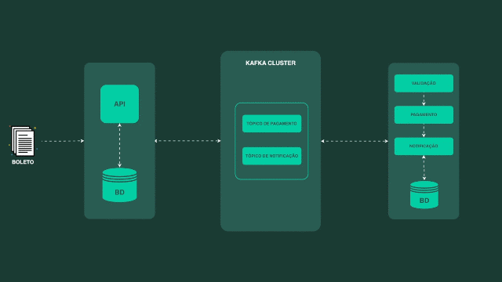

# springboot-kafka (boleto)

Projeto de exemplo com **2 aplicações Spring Boot** que se comunicam via **Apache Kafka** usando **Avro + Confluent Schema Registry** (eventos tipados + evolução de schema).



- **`api-boleto`**: API REST para emissão/consulta/atualização/cancelamento de boletos. Publica eventos no Kafka.
- **`validador-boleto`**: consome eventos de boleto emitido, valida o boleto e expõe um endpoint para confirmar pagamento (publicando o resultado no Kafka).

## Requisitos

- **Java 21**
- **Docker + Docker Compose** (para Kafka/Schema Registry/Kafka UI)

## Stack e ferramentas

- **Spring Boot 4.0.3** (módulos `api-boleto` e `validador-boleto`)
- **Spring Web MVC** (API REST)
- **Spring Data JPA** + **H2 in-memory** (persistência local por serviço)
- **Spring for Apache Kafka** / **spring-kafka**
- **Avro** + **Confluent Schema Registry**
  - serialização: `KafkaAvroSerializer`
  - desserialização: `KafkaAvroDeserializer` (com `specific.avro.reader=true`)
  - schema registry (default): `http://localhost:8085`
- **Maven Wrapper** (`mvnw`/`mvnw.cmd`) em ambos os módulos
- **Avro Maven Plugin** (gera classes Java a partir de `.avsc` em `generate-sources`)
- **Springdoc OpenAPI** (Swagger UI e `/v3/api-docs`)
- **Kafka UI** (Provectus) via Docker Compose para inspecionar tópicos/mensagens

## O que este projeto demonstra (detalhe técnico)

- **Arquitetura orientada a eventos**: o lifecycle do boleto é propagado via tópicos Kafka; cada serviço tem seu banco local e reage a eventos para manter o estado.
- **Contratos fortes de mensagem**: `BoletoEvento` é um evento Avro e o Schema Registry versiona/valida o schema usado por producers e consumers.
- **Produtor com confiabilidade** (`api-boleto`):
  - `acks=all`, `retries=3`, `enable.idempotence=true` (reduz risco de duplicidade na publicação)
- **Consumer com desserialização resiliente**:
  - ambos os serviços usam `ErrorHandlingDeserializer` como wrapper e delegam para `KafkaAvroDeserializer`
  - `auto-offset-reset=earliest` (útil em ambiente de dev)
- **Consistência eventual**:
  - ao confirmar pagamento no `validador-boleto`, a atualização do status no `api-boleto` acontece via consumo de `boleto-pago` (assíncrono).

## Subir a infraestrutura (Kafka + Schema Registry + UI)

Na raiz do repositório:

```bash
docker compose -f compose.yml up -d
```

Serviços:

- **Kafka**: `localhost:9092`
- **Schema Registry** (mapeado): `http://localhost:8085` (container escuta em 8081)
- **Kafka UI**: `http://localhost:8090`

## Rodar as aplicações

> As duas pastas são projetos Maven independentes (não há um `pom.xml` pai na raiz).

### `validador-boleto` (porta 8383)

```bash
cd validador-boleto
./mvnw spring-boot:run
```

No Windows (PowerShell):

```powershell
cd validador-boleto
.\mvnw.cmd spring-boot:run
```

### `api-boleto` (porta 8282)

```bash
cd api-boleto
./mvnw spring-boot:run
```

No Windows (PowerShell):

```powershell
cd api-boleto
.\mvnw.cmd spring-boot:run
```

## Configurações importantes (env vars)

Ambas as aplicações leem (com defaults):

- **`SPRING_KAFKA_BOOTSTRAP_SERVERS`**: default `localhost:9092`
- **`SCHEMA_REGISTRY_URL`**: default `http://localhost:8085`

Exemplo (PowerShell):

```powershell
$env:SPRING_KAFKA_BOOTSTRAP_SERVERS="localhost:9092"
$env:SCHEMA_REGISTRY_URL="http://localhost:8085"
```

## Tópicos Kafka

Configurados em `application.yaml`:

- **`boleto-emitido`**: evento publicado pela `api-boleto` quando um boleto é criado
- **`boleto-validado`**: notificação publicada pelo `validador-boleto` com o resultado da validação
- **`boleto-pago`**: evento publicado pelo `validador-boleto` quando o pagamento é confirmado; a `api-boleto` consome para atualizar o status no banco local

Observação: cada aplicação também declara tópicos via `NewTopic` (partições = 3, réplicas = 1).

## Contrato do evento (Avro)

O schema `BoletoEvento` fica em `src/main/avro/boletoevento.avsc` (em ambos os módulos) e contém:

- `codigoBarras` (string)
- `descricao` (string)
- `valor` (null|string)
- `situacao` (enum `StatusBoleto`)

Status relevantes (enum):

- `BOLETO_EMITIDO` (emissão)
- `BOLETO_VALIDADO` / `BOLETO_INVALIDO` (resultado da validação)
- `PAGAMENTO_CONFIRMADO` / `PAGAMENTO_CANCELADO` (resultado do pagamento)
- `ERRO_PROCESSAMENTO` (fallback usado no mapeamento de status)

## Persistência (H2) e modelo de dados

Ambos os serviços usam **H2 in-memory** (perde dados ao reiniciar):

- **`api-boleto`**: tabela principal de `Boleto` e filtros/paginação na listagem.
- **`validador-boleto`**:
  - persiste `ValidacaoBoleto` para evitar reprocessamento do mesmo `codigoBarras`
  - persiste `Pagamento` para impedir pagamento duplicado e auditar processamento

## Consumers / Producers (como as peças se encaixam)

- **`api-boleto`**
  - **Producer**: ao criar um boleto, persiste no H2 e publica `BoletoEvento` em **`boleto-emitido`**
  - **Consumer** (`BoletoStatusConsumer`): consome **`boleto-pago`** e atualiza o status do boleto no H2 local quando `situacao` é `PAGAMENTO_CONFIRMADO` ou `PAGAMENTO_CANCELADO`

- **`validador-boleto`**
  - **Consumer** (`BoletoConsumer`): consome **`boleto-emitido`**, valida o `codigoBarras` (44 dígitos) e registra o resultado em `ValidacaoBoleto`
  - **Producer** (`ValidacaoProducer`): publica notificação em **`boleto-validado`** (com `situacao=BOLETO_VALIDADO` ou `BOLETO_INVALIDO`)
  - **Endpoint REST** (`POST /pagamentos/confirmar`): confirma pagamento somente se o boleto já foi validado; publica resultado em **`boleto-pago`**

## Fluxo (visão geral)

```mermaid
flowchart LR
  A[api-boleto\nPOST /api/v1/boletos] -->|produz BoletoEvento\nsituacao=BOLETO_EMITIDO| T1[(kafka: boleto-emitido)]
  T1 -->|consome| B[validador-boleto\nBoletoConsumer]
  B -->|valida (44 dígitos)\nproduz situacao=BOLETO_VALIDADO/BOLETO_INVALIDO| T2[(kafka: boleto-validado)]
  C[validador-boleto\nPOST /pagamentos/confirmar] -->|produz situacao=PAGAMENTO_CONFIRMADO| T3[(kafka: boleto-pago)]
  T3 -->|consome| D[api-boleto\nBoletoStatusConsumer]
  D -->|atualiza status no H2| DB[(H2 api-boleto)]
```

## Endpoints e URLs úteis

### `api-boleto` (8282)

- **Swagger UI**: `http://localhost:8282/swagger-ui/index.html`
- **OpenAPI JSON**: `http://localhost:8282/v3/api-docs`
- **H2 Console**: `http://localhost:8282/h2-console`
  - JDBC URL: `jdbc:h2:mem:boletodb`
  - user: `admin`
  - pass: `admin123`

Principais rotas (base: `/api/v1/boletos`):

- `POST /api/v1/boletos` (emitir)
- `GET /api/v1/boletos` (listar com filtros/paginação)
- `GET /api/v1/boletos/{id}`
- `GET /api/v1/boletos/codigo-barras/{codigoBarras}`
- `PUT /api/v1/boletos/{id}`
- `PATCH /api/v1/boletos/{id}/cancelar`

### `validador-boleto` (8383)

- **Swagger UI**: `http://localhost:8383/swagger-ui/index.html`
- **OpenAPI JSON**: `http://localhost:8383/v3/api-docs`
- **H2 Console**: `http://localhost:8383/h2-console`
  - JDBC URL: `jdbc:h2:mem:validador-boleto`
  - user: `admin`
  - pass: `admin123`

Principal rota:

- `POST /pagamentos/confirmar`

## Exemplos rápidos (curl)

### 1) Emitir boleto (`api-boleto`)

```bash
curl -i -X POST "http://localhost:8282/api/v1/boletos" ^
  -H "Content-Type: application/json" ^
  -d "{\"codigo_barras\":\"34191090008200656560881380571000000000010000\",\"descricao\":\"Boleto de teste\",\"valor\":150.00,\"data_vencimento\":\"23/02/2026\"}"
```

Isso persiste no H2 da `api-boleto` e publica no tópico **`boleto-emitido`**.

### 2) Confirmar pagamento (`validador-boleto`)

> Requer que o código já tenha sido processado/validado pelo consumer (evento em `boleto-emitido`).

```bash
curl -i -X POST "http://localhost:8383/pagamentos/confirmar" ^
  -H "Content-Type: application/json" ^
  -d "{\"codigoBarras\":\"34191090008200656560881380571000000000010000\",\"valor\":150.00,\"descricao\":\"Pagamento do boleto\"}"
```

Isso publica no tópico **`boleto-pago`**; a `api-boleto` consome e atualiza a situação do boleto no H2 local.

## Troubleshooting

- **Schema Registry inacessível**: confirme `SCHEMA_REGISTRY_URL=http://localhost:8085` e que o `docker compose` está de pé.
- **Kafka UI sem cluster**: verifique `http://localhost:8090` e se o container `kafka` está saudável.
- **Eventos não chegam**:
  - confira se ambos apps estão apontando para o mesmo `bootstrap-servers`
  - confira no Kafka UI os tópicos `boleto-emitido`, `boleto-validado`, `boleto-pago`

